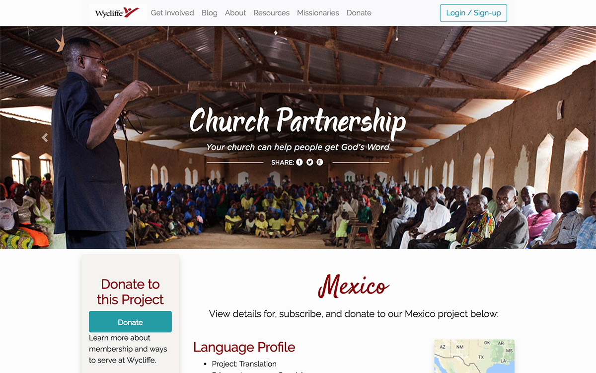
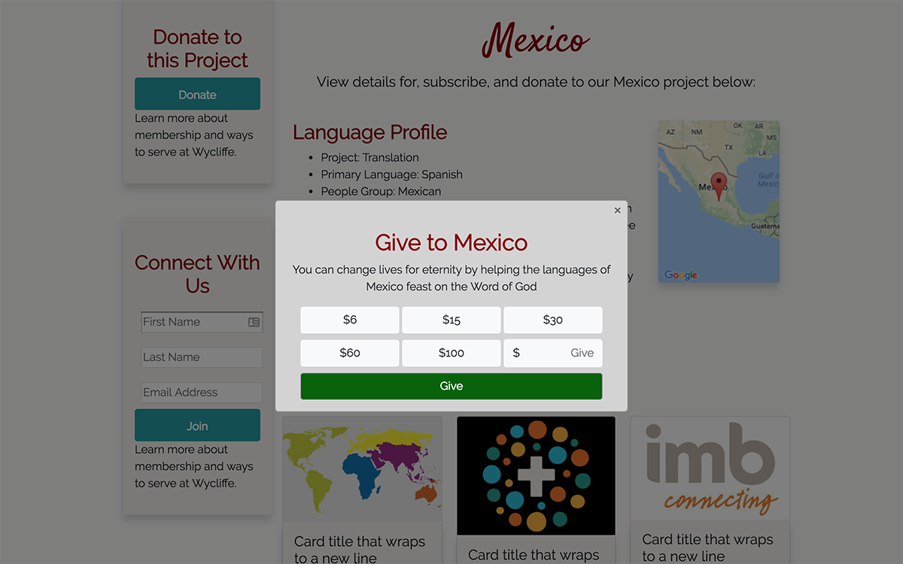
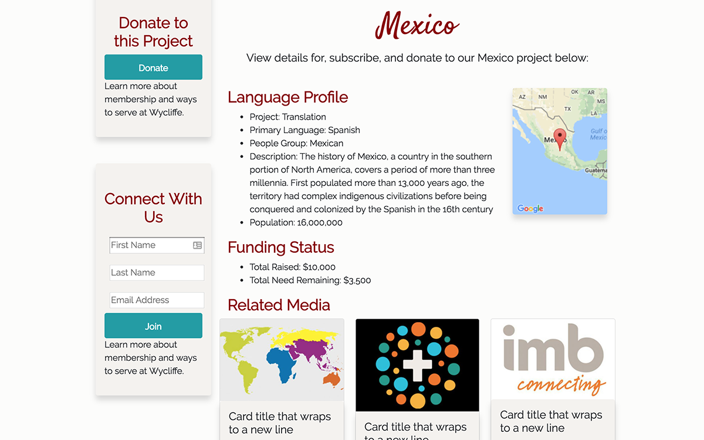
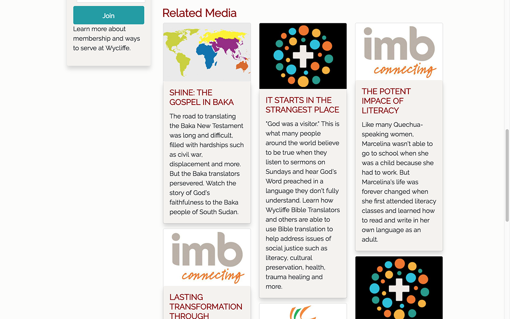
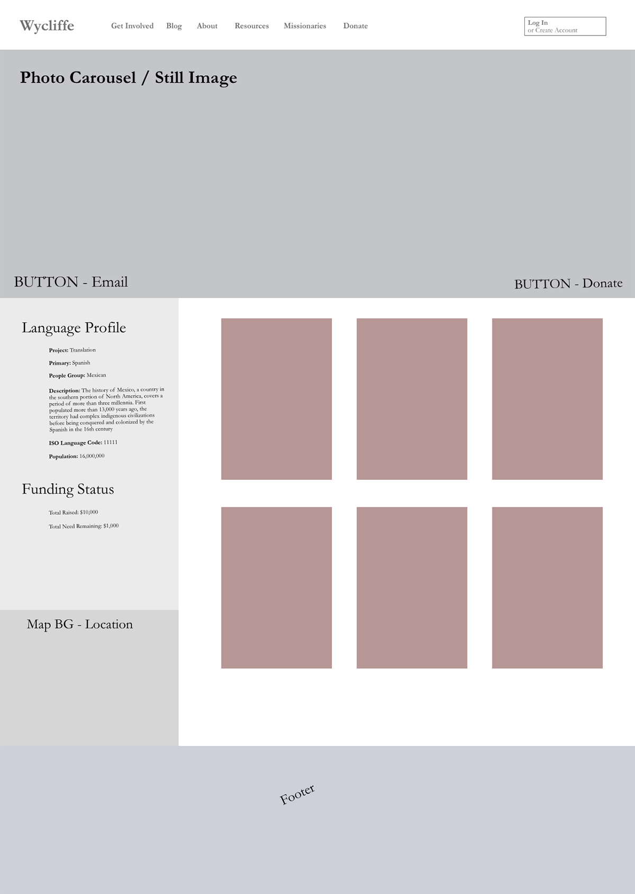

## Language Profile
Hello, this is a sample language profile for Wycliffe Bible Translators. You'll find a wireframe, as well as some screen shots of the project:

You'll notice the rotating carousel of banners on the live site, and the still image below:

Also included is a modal pop-up for those wanting to donate toward this project:

Along with the donation panel, the email subscription panel adds users to the MySQL database:

As you scroll down, you'll gain access to other articles and media; this can be highly customized:

The wireframe built on AdobeXD is attached below, as the beginning building block of the project:

